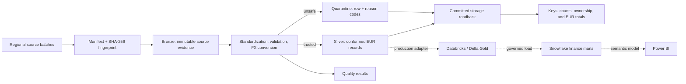

# Libra

**A finance-focused data pipeline for multi-country logistics operations.**

[](https://github.com/khanbelievable/Libra/actions/workflows/ci.yml)
[](https://www.python.org/downloads/)
[](LICENSE)

Libra models a recurring finance-engineering problem: regional systems deliver operational and invoice data in different currencies, and those deliveries are not always complete or clean. A reporting pipeline must convert values consistently, reject unsafe records, explain every rejection, and support replay without inflating revenue.

I built the first vertical slice around a fictional company, **Northstar Logistics Group**, operating in Germany, the Netherlands, France, the United Kingdom, and Türkiye. The implementation is deliberately local and reproducible; the Databricks, Snowflake, and Power BI boundaries are documented without pretending those cloud components are already deployed.

## What the current slice proves

- Deterministic generation of a full year of shipments, invoices, budgets, reference data, and daily FX rates.
- Batch-addressed Bronze history with full SHA-256 provenance and collision-checked short path IDs.
- Standardized Silver data using ISO country/currency codes, ISO dates, normalized identifiers, and fixed-scale decimal values.
- Exact-date EUR conversion with `Decimal`, never binary floating-point arithmetic.
- Quarantine of invalid financial/FX values, duplicate or conflicting invoices/rates, unknown
  references, missing exchange rates, and incomplete country deliveries.
- Cross-batch invoice ownership that prevents redelivery inflation and withholds every conflicting claim.
- Post-publication reconciliation of committed counts, business keys, batch contributions, and EUR totals.
- Version-aware no-op replay, owner-scoped corrections, and state-last crash recovery.
- Unit, integration, contract, and end-to-end demo tests that run without cloud credentials.

## Architecture



The solid path is implemented and executable today. Dashed connections show the target production architecture. Business transformations belong in Databricks/Delta; Snowflake governs and serves conformed finance data; Power BI owns semantic measures and report interaction. This prevents the same finance rule from being implemented twice.

See [Architecture](docs/ARCHITECTURE.md) and [ADR-001](docs/adr/ADR-001-platform-responsibilities.md) for the complete rationale.

## Demonstrated failure scenarios

The generated failures are deterministic, which makes the expected behavior reviewable and testable.

| Scenario | Received invoices | Trusted invoices | Quarantined | Trusted revenue (EUR) | Result |
|---|---:|---:|---:|---:|---|
| Healthy annual delivery | 720 | 720 | 0 | 916,351.47 | Pass |
| Resent invoice rows | 732 | 720 | 12 | 916,351.47 | `DUPLICATE_INVOICE` |
| Missing March GBP rates | 720 | 708 | 12 | 900,446.34 | `MISSING_EXCHANGE_RATE` |
| Germany delivery 70% below baseline | 619 | 576 | 43 | 697,854.41 | `COUNTRY_VOLUME_DROP` |

The missing-FX scenario also quarantines 12 affected shipments and 2 budgets. Every scenario still passes row-count and convertible-financial-total reconciliation because quarantine is explicitly accounted for.

Full evidence: [Slice 001 expected results](demo/expected-results/SLICE_001.md).

## Key engineering decisions

| Decision | Reason |
|---|---|
| One unit of source currency maps to a versioned `rate_to_eur` value | Makes conversion direction explicit and testable |
| Invoice date selects the daily FX rate | Provides deterministic behavior pending a final finance policy decision |
| Active batches retain invoice claims by owner | Exact redelivery cannot inflate revenue; conflicts withhold every occurrence until correction |
| Under-volume country partitions are withheld as a unit | Row-level validity cannot prove that a partial delivery is complete |
| Fingerprint + processing-contract versions control replay | Prevents newer code from blessing stale outputs |
| Local CSV is an adapter, not the domain model | Keeps local verification fast and cloud implementation replaceable |

The decisions are recorded individually under [docs/adr](docs/adr).

## Run it locally

Python 3.12 is required.

```bash
python -m venv .venv
```

Activate the environment:

```powershell
# Windows PowerShell
.venv\Scripts\Activate.ps1
```

```bash
# macOS or Linux
source .venv/bin/activate
```

Install and run the healthy path:

```bash
python -m pip install --upgrade pip
python -m pip install -e ".[dev]"
libra generate healthy --output data/generated
libra run healthy --input data/generated --output data/processed
```

Run the controlled failure demonstrations:

```bash
libra generate broken --output data/generated
libra run broken --input data/generated --output data/processed
```

`libra run broken` intentionally returns exit code `2` after persisting quality results and quarantined rows. This distinguishes an expected data-quality failure from an infrastructure or schema failure.

## Inspect the result

After a healthy run:

```text
data/processed/healthy/
├── bronze/          source payloads retained by batch and fingerprint
├── silver/          trusted standardized datasets
├── quarantine/      rejected rows with stable reason codes
├── quality/         PASS and FAIL rule results
├── reconciliation/  committed keys, counts, ownership, and EUR totals
├── runs/            machine-readable batch summaries
├── claims/          batch-owned invoice claims used for global deduplication
└── state/           versioned replay identity and trusted refresh status
```

An unchanged rerun returns `already_processed` only when its source fingerprint, pipeline,
data-contract, rules fingerprint, and prior run summary are compatible. If the same batch ID
arrives with a correction, its claims and outputs replace only that batch's contribution; unrelated
owners remain intact.

## Verification

```bash
python -m pytest -q --cov=datalibra --cov-report=term --cov-branch --cov-fail-under=90
python -m ruff check .
python -m ruff format --check .
python -m mypy src/datalibra
python -m pip check
```

Current Slice 001.1 baseline: **82 tests passing** and **96.91% branch-aware coverage**. GitHub
Actions repeats the gate on Windows and Linux, then installs the built wheel and smoke-tests the
CLI outside the checkout.

## Repository map

```text
src/datalibra/       generator, domain rules, pipeline, CLI, storage adapter
config/              dataset keys, quality thresholds, environment settings
tests/               unit, integration, contract, and demo evidence
demo/                scenario instructions and expected results
docs/                architecture, model, KPIs, quality rules, ADRs, backlog
databricks/           approved production job/export contracts
snowflake/            serving-schema and role contracts
powerbi/              relationships, DAX measures, and report-page specifications
```

Start with the [documentation index](docs/README.md), [data-quality rules](docs/DATA_QUALITY_RULES.md),
and [Slice 001.1 remediation handoff](docs/handoffs/CODEX_REMEDIATION_SLICE_001_1.md).

## Current boundary and roadmap

The local Bronze-to-Silver slice is implemented. Routes, operational cost transactions, late-arriving invoice demonstrations, actual PySpark/Delta jobs, Snowflake migrations, and a Power BI PBIP project remain planned work. Their interfaces are documented so that future implementation has an explicit contract, but they are not presented as completed.

The next planned vertical slice adds route and operational-cost data, then produces reconciled
customer, route, and cost-center profitability. It remains gated on independent Slice 001.1
re-review.

See the [backlog](docs/BACKLOG.md) for acceptance criteria and dependencies.

## Data and license

All company names and records are deterministic synthetic data. No proprietary carrier data or credentials are included.

Released under the [MIT License](LICENSE).
