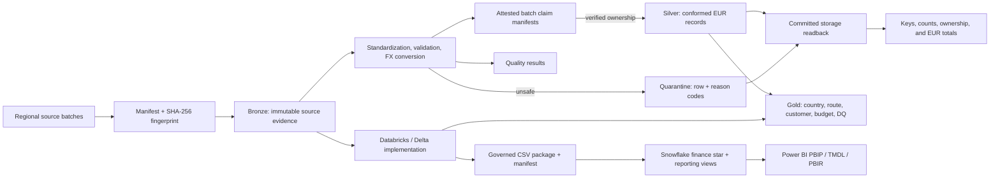

# Libra

**A finance-focused data pipeline for multi-country logistics operations.**

[](https://github.com/khanbelievable/Libra/actions/workflows/ci.yml)
[](https://www.python.org/downloads/)
[](LICENSE)

Libra models a recurring finance-engineering problem: regional systems deliver operational and invoice data in different currencies, and those deliveries are not always complete or clean. A reporting pipeline must convert values consistently, reject unsafe records, explain every rejection, and support replay without inflating revenue.

I built Libra around a fictional company, **Northstar Logistics Group**, operating in Germany,
the Netherlands, France, the United Kingdom, and Türkiye. Milestone 1 includes a deterministic
local oracle plus an authenticated Databricks serverless execution whose Delta results match that
oracle exactly. Milestone 2 adds an executable Snowflake serving adapter and a real,
source-controlled Power BI project; authenticated Snowflake deployment and Desktop refresh remain
explicit external gates.

## What Milestone 1 proves

- Deterministic generation of routes, 720 routed shipments, 720 invoices, 2,880 operational costs,
  budgets, reference data, and daily FX rates.
- Batch-addressed Bronze history with full SHA-256 provenance and collision-checked short path IDs.
- Standardized Silver data using ISO country/currency codes, ISO dates, normalized identifiers, and fixed-scale decimal values.
- Exact-date EUR conversion with `Decimal`, never binary floating-point arithmetic.
- Quarantine of invalid financial/FX values, duplicate or conflicting invoices/rates, unknown
  references, missing exchange rates, and incomplete country deliveries.
- Stable cross-batch invoice ownership ranked by persisted arrival sequence, with financial
  fingerprints that include the applied FX rate and translated EUR amount.
- Independently attested batch claim manifests, a rebuildable claims index, and post-publication
  reconciliation of committed counts, business keys, batch contributions, and EUR totals.
- Version-aware no-op replay that verifies every committed artifact, owner-scoped corrections,
  and fault-tested state-last crash recovery.
- Canonical internal CSV values with formula neutralization isolated to explicit spreadsheet
  exports.
- Five deterministic Gold outputs for country finance, route/customer profitability,
  budget-versus-actual, and data quality.
- A focused historical cost correction with auditable before/after controls and no duplicate
  revenue or cost.
- Real PySpark transformations, DecimalType finance fields, Delta MERGE publication code, and a
  deployable three-task Databricks job.
- Authenticated bundle validation, serverless deployment, three-task workspace execution, Delta
  inspection, local/cloud parity, and declared-owner correction evidence.

## Architecture



The local and Databricks/Delta code paths are implemented and cloud-verified. The governed export,
Snowflake migrations/loader, and Power BI source project are implemented and locally
contract-validated. Business transformations remain in Databricks/Delta; Snowflake governs and
serves conformed finance data; Power BI owns semantic measures and report interaction. See
[Milestone 2 validation](docs/MILESTONE_2_VALIDATION.md) for the deliberately unclaimed external
deployment and refresh gates.

See [Architecture](docs/ARCHITECTURE.md) and [ADR-001](docs/adr/ADR-001-platform-responsibilities.md) for the complete rationale.

## Demonstrated failure scenarios

The generated failures are deterministic, which makes the expected behavior reviewable and testable.

| Scenario | Received invoices | Trusted invoices | Quarantined | Trusted revenue (EUR) | Result |
|---|---:|---:|---:|---:|---|
| Healthy annual delivery | 720 | 720 | 0 | 916,351.47 | Pass |
| Resent invoice rows | 732 | 720 | 12 | 916,351.47 | `DUPLICATE_INVOICE` |
| Missing March GBP rates | 720 | 708 | 12 | 900,446.34 | `MISSING_EXCHANGE_RATE` |
| Germany delivery 70% below baseline | 619 | 576 | 43 | 697,854.41 | `COUNTRY_VOLUME_DROP` |
| Invalid operational costs | 720 | 720 | 9 costs | 916,351.47 | precise cost reason codes |

The missing-FX scenario also quarantines 12 affected shipments, 2 budgets, and 48 costs. Every
scenario still passes row-count and convertible-financial-total reconciliation because quarantine
is explicitly accounted for.

Healthy Gold controls:

| Revenue (EUR) | Operational cost (EUR) | Gross profit (EUR) | Budget (EUR) |
|---:|---:|---:|---:|
| 916,351.47 | 230,279.65 | 686,071.82 | 3,048,056.60 |

Full evidence: [Slice 001 expected results](demo/expected-results/SLICE_001.md).

## Key engineering decisions

| Decision | Reason |
|---|---|
| One unit of source currency maps to a versioned `rate_to_eur` value | Makes conversion direction explicit and testable |
| Invoice date selects the daily FX rate | Provides deterministic behavior pending a final finance policy decision |
| Immutable arrival sequence ranks batch-owned invoice claims | JSON ordering cannot change ownership; exact redelivery cannot inflate revenue |
| State attests claim manifests and committed run artifacts | Missing or altered evidence cannot silently shrink trusted output or produce a false no-op |
| Under-volume country partitions are withheld as a unit | Row-level validity cannot prove that a partial delivery is complete |
| Fingerprint + processing-contract versions control replay | Prevents newer code from blessing stale outputs |
| Local CSV is an adapter, not the domain model | Keeps local verification fast and cloud implementation replaceable |
| Costs allocate directly through shipment | Route/customer profit reconciles without a speculative shared-cost engine |
| Month-opening FX rate is the comparison baseline | Makes FX impact deterministic and separately reviewable by Finance |
| Delta facts preflight ownership before batch MERGE | Same-batch correction is scoped; only an explicit manifest supersession may transfer an existing owner |

The decisions are recorded individually under [docs/adr](docs/adr).

## Run it locally

Python 3.12 is required.

```bash
python -m venv .venv
```

Activate the environment:

```powershell
# Windows PowerShell
.venv\Scripts\Activate.ps1
```

```bash
# macOS or Linux
source .venv/bin/activate
```

Install and run the healthy path:

```bash
python -m pip install --upgrade pip
python -m pip install -e ".[dev,spark]"
libra generate healthy --output data/generated
libra run healthy --input data/generated --output data/processed
```

Run the controlled failure demonstrations:

```bash
libra generate broken --output data/generated
libra run broken --input data/generated --output data/processed
```

`libra run broken` intentionally returns exit code `2` after persisting quality results and quarantined rows. This distinguishes an expected data-quality failure from an infrastructure or schema failure.

Run the historical correction:

```bash
libra generate correction --output data/generated
libra run correction --input data/generated --output data/processed
```

## Inspect the result

After a healthy run:

```text
data/processed/healthy/
├── bronze/          source payloads retained by batch and fingerprint
├── silver/          trusted standardized datasets
├── quarantine/      rejected rows with stable reason codes
├── quality/         PASS and FAIL rule results
├── reconciliation/  committed keys, counts, ownership, and EUR totals
├── runs/            machine-readable batch summaries
├── claims/          attested batch manifests plus a rebuildable aggregate index
├── gold/            five analytics contracts plus Silver control reconciliation
└── state/           arrival order, artifact attestations, replay identity, recovery status
```

An unchanged rerun returns `already_processed` only when its source fingerprint, processing
versions, claim manifest/index, Silver, quarantine, quality, reconciliation, and summary
attestations are compatible. Missing or altered reconstructible evidence is deterministically
repaired; damage to another active batch fails closed. If the same batch ID arrives with a
correction, its immutable arrival sequence is retained and only its contribution is replaced.

## Verification

```bash
python -m pytest -q --cov=datalibra --cov-report=term --cov-branch --cov-fail-under=90
python -m ruff check .
python -m ruff format --check .
python -m mypy src/datalibra
python -m pip check
```

The Milestone 1 gate includes the full trust suite, branch-aware coverage above 90%, local Spark
financial parity, bundle structure, a built/installed wheel, healthy/broken/correction CLI runs,
and the cloud-status checks recorded in
[Milestone 1 validation](docs/MILESTONE_1_VALIDATION.md).

## Repository map

```text
src/datalibra/       trust core, Gold analytics, PySpark/Delta tasks, Snowflake adapter, CLIs
config/              dataset keys, quality thresholds, environment settings
tests/               unit, integration, contract, and demo evidence
demo/                scenario instructions and expected results
docs/                architecture, model, KPIs, quality rules, ADRs, backlog
databricks/           executable three-task job resource and Delta runbook
snowflake/            executable migrations, governed load, controls, roles, and SQL tests
powerbi/              real PBIP/TMDL/PBIR model, measures, pages, and report specifications
```

Start with the [Milestone 1 validation](docs/MILESTONE_1_VALIDATION.md),
[Milestone 2 validation](docs/MILESTONE_2_VALIDATION.md),
[Databricks runbook](docs/DATABRICKS_RUNBOOK.md), and
[KPI definitions](docs/KPI_DEFINITIONS.md).

## Current boundary and roadmap

Local Bronze/Silver/Gold analytics and the PySpark/Delta bundle are implemented. Authenticated
workspace validation, deployment, healthy execution, Delta inspection, zero-difference
local/cloud reconciliation, and the historical correction are complete. The public-safe evidence
is recorded in [Milestone 1 validation](docs/MILESTONE_1_VALIDATION.md).

Milestone 2 source implementation is present, but the milestone is not complete: this machine has
no Snowflake connection profile and no Power BI Desktop installation. The repository therefore
does not claim Snowflake deployment/load/reconciliation or Power BI refresh/render validation.
Milestone 3 must not begin until those gates are completed.

See the [backlog](docs/BACKLOG.md) for acceptance criteria and dependencies.

## Data and license

All company names and records are deterministic synthetic data. No proprietary carrier data or credentials are included.

Released under the [MIT License](LICENSE).
