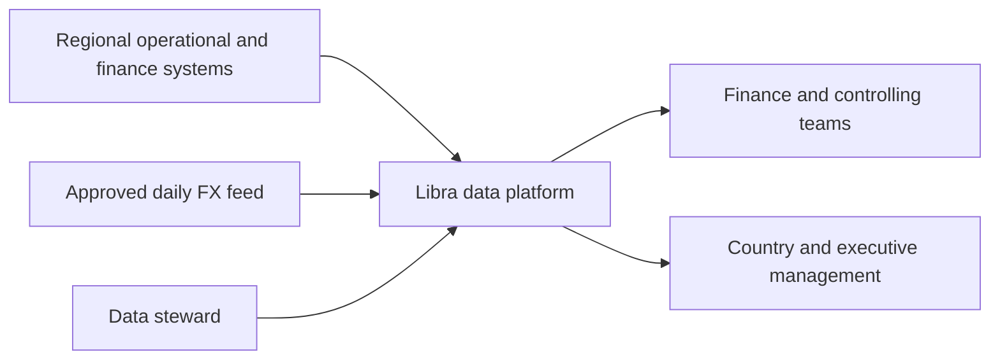
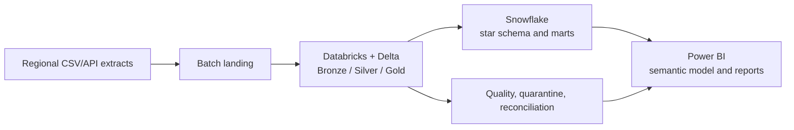
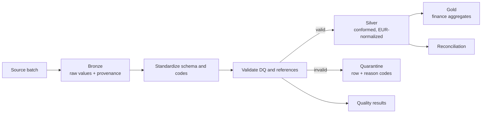
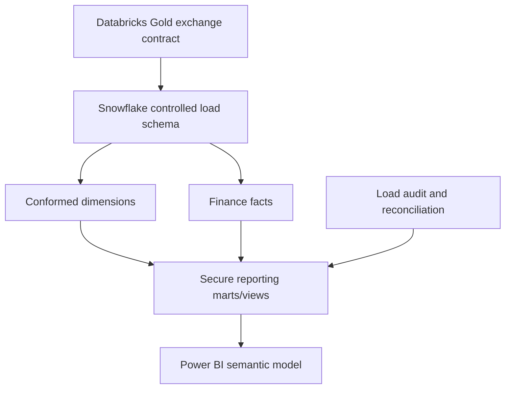
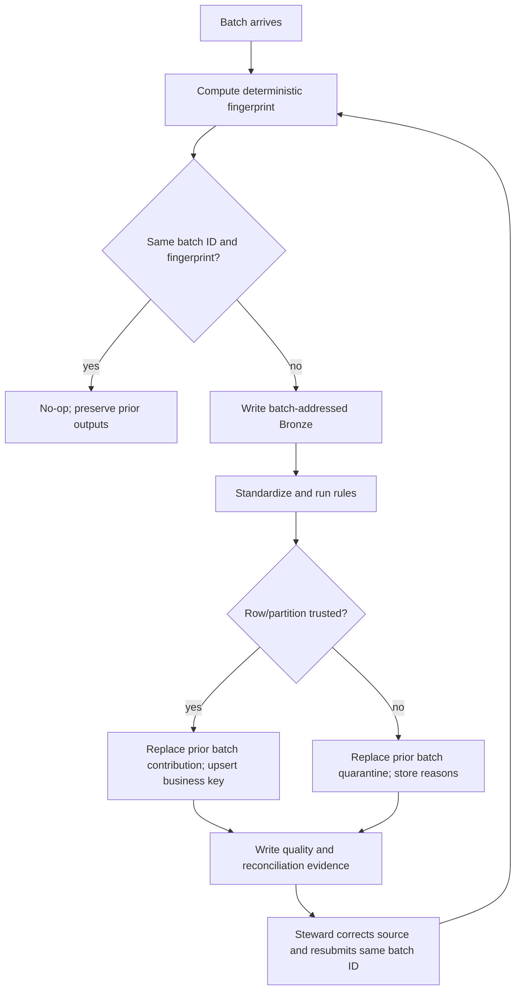

# Architecture

## Summary

Regional files are landed as batch-addressed source data. Databricks is the future production compute plane: it incrementally captures Bronze evidence, applies domain rules once in Silver, and creates finance aggregates in Gold. Snowflake receives governed, already-conformed facts and dimensions and owns access-controlled reporting marts/views. Power BI owns semantic relationships, reusable DAX measures, and user navigation. Slice 001 uses a local filesystem adapter with the same batch and domain contracts.

## System context

## End-to-end data flow

## Databricks medallion flow

## Snowflake serving model

Snowflake does not repeat cleansing, FX conversion, or deduplication. It enforces load contracts, maintains warehouse keys/history where required, and serves governed SQL.

## Failure, quarantine, correction, and reprocessing

## Local-to-cloud compatibility

The domain layer works on typed row mappings and produces explicit valid rows, quarantined rows, and rule outcomes. Local CSV storage is an adapter. The production PySpark adapter will express the same rules as DataFrame transformations and Delta merges; it must pass the same contract fixtures. This avoids requiring Java/Spark for a basic portfolio demonstration while keeping cloud logic isolated.

## Operational semantics

- A quality failure is a controlled completed run with failed rule results and quarantined rows.
- An unreadable schema, corrupt manifest, or storage failure is an execution failure.
- Bronze is addressed by batch ID and a checked 80-bit SHA-256 prefix in a flat path, while the full fingerprint is retained in provenance, manifest, summary, and state. An identifier collision fails rather than overwriting evidence.
- The local adapter is single-writer. Per-file replacement is atomic and processed state is written last; rerun is the crash-recovery mechanism.
- Silver replacement is keyed by batch contribution before business-key merge, making corrected reprocessing safe.
- Timestamps used in generated demo evidence come from deterministic batch metadata. A production adapter uses the orchestrator's UTC execution timestamp.
