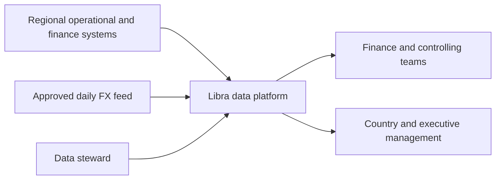
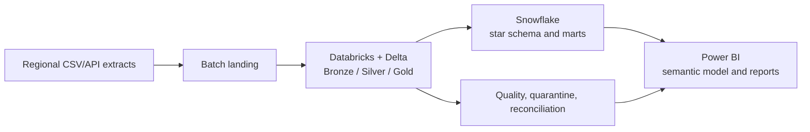
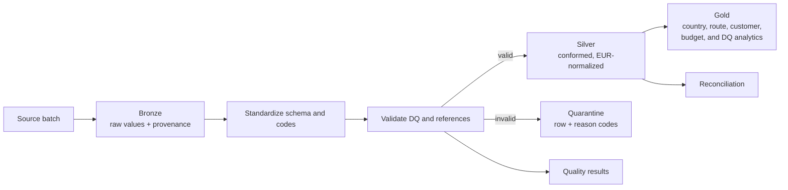
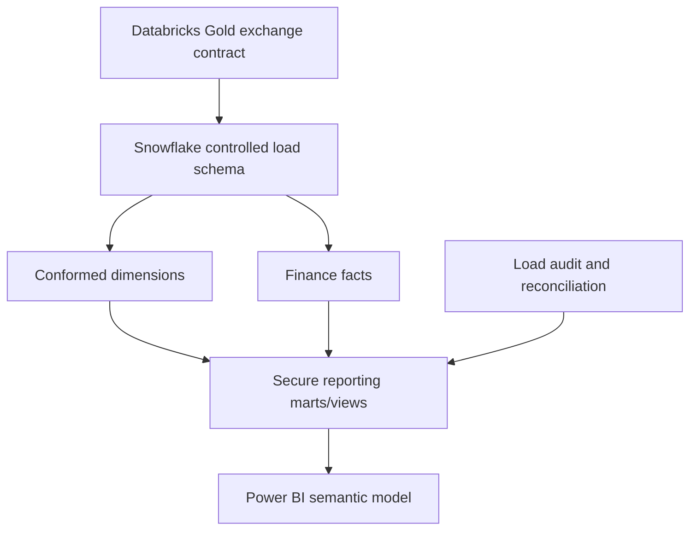
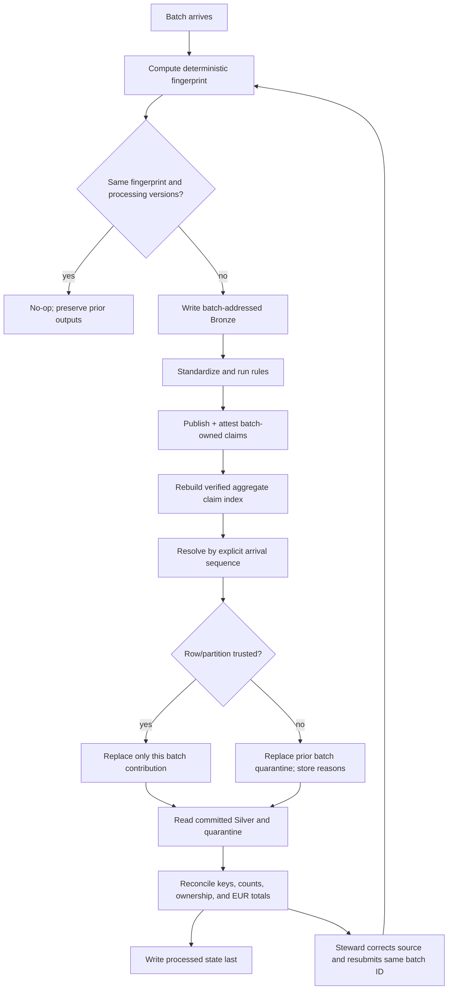

# Architecture

## Summary

Regional files are landed as batch-addressed source data. Milestone 1 implements two execution
paths: a deterministic local oracle and a deployable PySpark/Delta Databricks path. Both capture
Bronze evidence, standardize and validate Silver, convert transaction currency to EUR, and produce
five reconciled Gold contracts. Milestone 2 implements the governed extract, Snowflake
migrations/loader, and PBIP/TMDL/PBIR source. Snowflake deployment and Power BI runtime evidence
are not claimed without the unavailable account/Desktop prerequisites.

## System context

## End-to-end data flow

## Databricks medallion flow

## Snowflake serving model

Snowflake does not repeat cleansing, FX conversion, or deduplication. A checksum-owned CSV
package carries approved Silver rows; the invoice comparison amount is calculated in the
Databricks-side export using the same month-opening-rate contract as Gold. Snowflake enforces
load contracts, resolves surrogate keys, publishes facts through natural-key MERGE statements,
records audits/reconciliation, and serves governed SQL. Route and customer keys on serving facts
are direct shipment lookups, not shared-cost allocations.

## Failure, quarantine, correction, and reprocessing

## Local-to-cloud compatibility

The local domain layer produces explicit trusted rows, quarantine, quality, reconciliation, and
Gold controls. The implemented PySpark path uses explicit source schemas, DateType, DecimalType,
DataFrame validation/FX transformations, and Delta tables. Local Spark contracts compare cloud
transform totals to the local oracle.

Databricks Bronze MERGE is idempotent by batch, fingerprint, and deterministic source row. Global
reference tables merge by natural key. Financial facts preflight natural-key ownership and then
transactionally replace only the current batch contribution. The focused correction manifests
explicitly name the healthy batch they supersede, allowing one atomic Delta MERGE per fact table
to transfer only that declared contribution. Every undeclared cross-batch collision still fails
closed; richer invoice claim resolution remains in the local trust core and is recorded in
`docs/FUTURE_WORK.md`.

The Declarative Automation Bundle deploys one job with three tasks:
`land_bronze`, `build_silver`, and `build_gold_and_validate`. Gold is replaced only after Silver
finishes, and the final task writes the non-Gold `reconciliation_controls` Delta audit table
before reporting success.

## Operational semantics

- A quality failure is a controlled completed run with failed rule results and quarantined rows.
- An unreadable schema, corrupt manifest, or storage failure is an execution failure.
- Bronze is addressed by batch ID and a checked 80-bit SHA-256 prefix in a flat path, while the full fingerprint is retained in provenance, manifest, summary, and state. An identifier collision fails rather than overwriting evidence.
- The local adapter is single-writer. Per-file replacement is atomic and processed state is written last; rerun is the crash-recovery mechanism.
- Every accepted batch receives an immutable positive `arrival_sequence`. New values are
  `max(existing) + 1`; JSON/dictionary order, batch ID, timestamps, filenames, and filesystem order
  never rank normal ownership.
- `claims/invoices/<batch_id>.csv` is the batch-owned invoice contribution. State attests its
  count, exact digest, and business-key digest. `claims/invoices.csv` is a verified rebuildable
  index, never an independent authority.
- Exact replay requires an identical normalized financial claim including source amount,
  currency, translation date, applied rate, translated EUR amount, dimensions, and shipment.
  Conflicting financial fingerprints withhold all active invoice occurrences.
- Committed-output reconciliation reads through `PipelineStorage`; it does not attest an
  in-memory partition as though it were persisted data.
- Replay identity combines source fingerprint, package pipeline version, data-contract version,
  and deterministic quality-rules fingerprint. A mismatch rebuilds instead of returning a no-op.
- Valid rows from a quality-failed batch publish, but the trusted refresh watermark does not
  advance. Local direct consumers must honor state.
- Internal CSVs retain canonical values exactly. Spreadsheet formula neutralization is an
  explicit presentation/export operation whose output is never read as canonical storage.
- Shipment, budget, and operational-cost exact cross-batch repeats retain the existing owner and write noncritical
  evidence; conflicting monetary payloads fail closed. Dimensions and FX references do not have
  generalized claim ownership in Slice 001.2 and remain a documented limitation.
- Publication order is: verify active attestations; Bronze; inflight recovery marker; batch claim
  manifest; aggregate claims index; Silver/quarantine; committed reconciliation; quality;
  reconciliation JSON; summary; processed state last. The marker never represents success and is
  cleared after state. An exact retry converges at every boundary.
- Every operational cost is directly linked to a shipment, route, and cost center. Route and
  customer Gold allocation is therefore direct rather than estimated.
- FX impact compares transaction-date translation to the first available same-currency rate in
  that calendar month; revenue variance less cost variance is reported by month/country.
- Timestamps used in generated demo evidence come from deterministic batch metadata. A production adapter uses the orchestrator's UTC execution timestamp.
